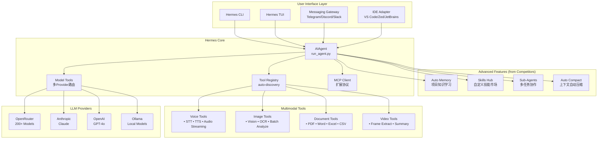
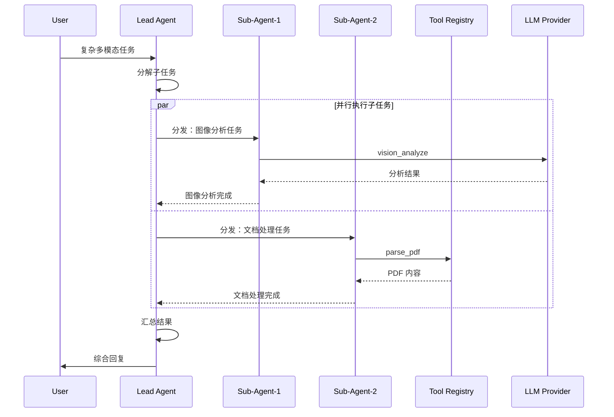
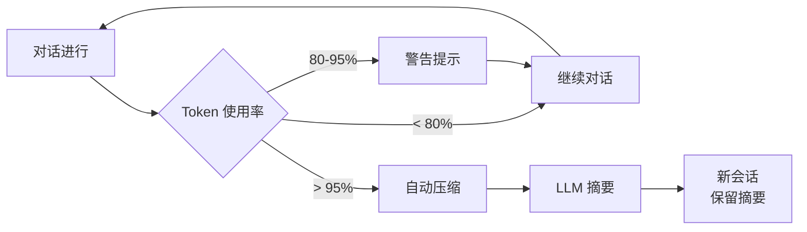
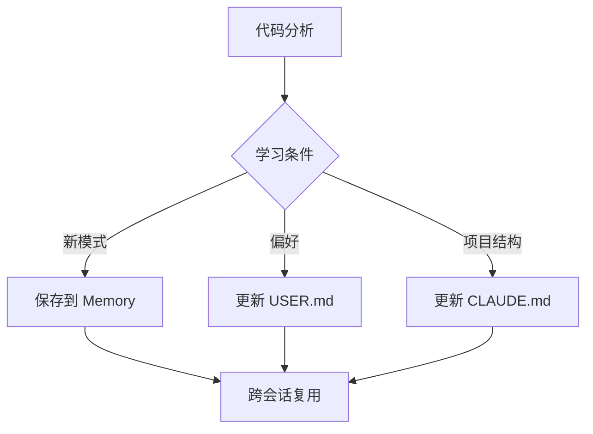
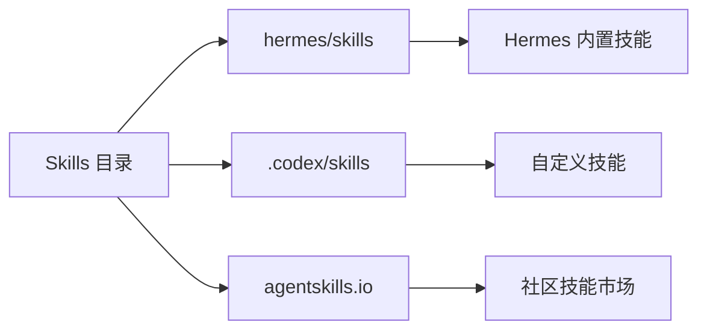

# Hermes Multimodal Agent - Technical Design

Feature Name: hermes-multimodal-agent
Updated: 2026-04-17

## Description

基于 Hermes Agent 核心架构，扩展其工具生态以支持语音、图像、文档、视频等多种模态的输入输出能力。通过整合 OpenCode、Claude Code、Codex 等优秀 AI Agent 的最佳特性，构建一个功能强大的综合型多模态 AI Agent。

## Competitor Analysis - Best Features

### From OpenCode (12.1k stars)
| Feature | Description | Enhancement to Adopt |
|---------|-------------|---------------------|
| **Auto Compact** | 自动上下文压缩，当接近 context window 95% 时自动摘要 | 集成到 Hermes 的 context_compressor |
| **Custom Commands** | 用户自定义命令模板，支持命名参数 | 扩展 Hermes Skills 系统 |
| **MCP Integration** | Model Context Protocol 支持 | 增强现有 MCP 工具 |
| **LSP Integration** | Language Server Protocol 支持 | 复用 Hermes 已有能力 |
| **Session Management** | 多会话管理和切换 | 复用 Hermes 已有能力 |

### From Claude Code (115k stars)
| Feature | Description | Enhancement to Adopt |
|---------|-------------|---------------------|
| **Multi-Surface** | Terminal/VS Code/JetBrains/Desktop/Web 多端支持 | 复用 Hermes Gateway |
| **Sub-Agents** | 多 Agent 协作，子任务分发 | 增强 delegate_tool |
| **Routines** | 定时任务调度 | 复用 Hermes Cron 系统 |
| **CLAUDE.md Memory** | 项目级记忆文件 | 扩展 Hermes Context Files |
| **Auto Memory** | 自动学习项目知识 | 增强 Hermes Memory Manager |
| **Git Workflows** | 内置 Git 工作流 | 复用 Hermes 已有工具 |
| **Privacy-First** | 数据隐私保护 | 增强本地处理能力 |

### From Codex CLI (76k stars)
| Feature | Description | Enhancement to Adopt |
|---------|-------------|---------------------|
| **Skills System** | .codex/skills 目录定义技能 | 扩展 Hermes Skills Hub |
| **IDE Integration** | VS Code/Cursor/Windsurf 插件 | 复用 Hermes ACP Adapter |
| **Lightweight** | 轻量级 Rust 实现 | 保持 Python 轻量化 |

## Architecture

### Enhanced System Architecture



### Multi-Agent Collaboration Flow



### Auto Compact Flow (from OpenCode)



## Components and Interfaces

### 1. Voice Tools (`tools/voice_tools.py`)

#### Enhanced Components
| 组件 | 功能 | 借鉴来源 |
|------|------|----------|
| `transcription_tools.py` | STT 语音转文本 | Hermes 已有 |
| `tts_tool.py` | TTS 文本转语音 | Hermes 已有 |
| `voice_mode.py` | 语音模式管理 | Hermes 已有 |
| `audio_streaming.py` | **NEW** 流式语音处理 | Claude Code 语音交互 |

#### Interface
```python
def voice_input_tool(audio_path: str, task_id: str = None) -> str:
    """处理语音输入，返回文本内容"""

def voice_output_tool(text: str, voice_id: str = None, task_id: str = None) -> str:
    """处理语音输出，返回音频文件路径"""

def audio_streaming_tool(audio_stream: bytes, task_id: str = None) -> str:
    """NEW: 流式语音处理，支持实时语音对话"""
```

### 2. Image Tools (`tools/image_tools.py`)

#### Enhanced Components
| 组件 | 功能 | 借鉴来源 |
|------|------|----------|
| `vision_tools.py` | 图像分析 | Hermes 已有 |
| `image_generation_tool.py` | 图像生成 | Hermes 已有 |
| `ocr_tool.py` | **NEW** OCR 文本提取 | 新增 |
| `image_batch_analyze.py` | **NEW** 批量图像分析 | OpenCode 批处理 |
| `image_compare.py` | **NEW** 图像对比 | 新增 |

#### Interface
```python
def ocr_image_tool(image_path: str, language: str = "eng", task_id: str = None) -> str:
    """从图像中提取文本内容，支持多语言"""

def batch_image_analyze_tool(image_paths: list, user_prompt: str, task_id: str = None) -> str:
    """批量分析多张图像，整合分析结果"""

def image_compare_tool(image_path1: str, image_path2: str, task_id: str = None) -> str:
    """NEW: 对比两张图像的差异"""
```

### 3. Document Tools (`tools/document_tools.py`)

#### New Components
| 组件 | 功能 | 借鉴来源 |
|------|------|----------|
| `pdf_parser_tool.py` | PDF 解析 | 新增 |
| `docx_parser_tool.py` | Word 文档解析 | 新增 |
| `spreadsheet_parser_tool.py` | Excel/CSV 解析 | 新增 |
| `document_index.py` | **NEW** 文档索引和搜索 | Claude Code 代码库理解 |

#### Interface
```python
def parse_pdf_tool(file_path: str, max_pages: int = None, task_id: str = None) -> str:
    """解析 PDF 文件，返回文本内容和元数据"""

def parse_docx_tool(file_path: str, task_id: str = None) -> str:
    """解析 Word 文档，支持表格和图片提取"""

def parse_spreadsheet_tool(file_path: str, sheet_name: str = None, task_id: str = None) -> str:
    """解析电子表格，支持公式和数据透视表"""

def index_document_tool(file_path: str, task_id: str = None) -> str:
    """NEW: 索引文档内容到记忆系统，支持语义搜索"""
```

### 4. Video Tools (`tools/video_tools.py`)

#### New Components
| 组件 | 功能 | 借鉴来源 |
|------|------|----------|
| `video_frame_extractor.py` | 视频帧提取 | 新增 |
| `video_analyzer.py` | 视频内容分析 | 新增 |
| `video_timeline.py` | **NEW** 视频时间线生成 | 新增 |

#### Interface
```python
def extract_video_frames_tool(video_path: str, interval_sec: int = 5, max_frames: int = 20, task_id: str = None) -> str:
    """从视频中提取关键帧"""

def analyze_video_tool(video_path: str, user_prompt: str, task_id: str = None) -> str:
    """分析视频内容并生成摘要和时间线"""

def generate_video_timeline_tool(video_path: str, task_id: str = None) -> str:
    """NEW: 生成视频时间线，标注关键事件"""
```

## Advanced Features (Competitor Integration)

### 1. Auto Memory System (from Claude Code)



**实现要点：**
- 自动检测项目框架和模式
- 学习构建命令和依赖管理
- 记住调试技巧和常见问题
- 跨会话持久化

### 2. Skills Hub Enhancement (from Codex)



**技能结构：**
```
skills/
├── custom_skill/
│   ├── SKILL.md          # 技能定义
│   ├── instructions.md   # 详细指令
│   └── examples/         # 示例
```

### 3. Sub-Agents Enhancement (from Claude Code)

```python
# 增强的 delegate_tool.py
def delegate_task_tool(
    task: str,
    agent_type: str = "general",  # general/coder/reviewer/writer
    max_iterations: int = 50,
    task_id: str = None
) -> str:
    """
    分发任务给子 Agent，支持专业分工：
    - general: 综合处理
    - coder: 代码开发
    - reviewer: 代码审查
    - writer: 文档撰写
    """
```

### 4. Auto Compact (from OpenCode)

```python
# 增强的 context_compressor.py
class SmartContextCompressor:
    def __init__(self, threshold: float = 0.95):
        self.threshold = threshold

    def should_compress(self, messages: list, context_limit: int) -> bool:
        """当使用率达到 threshold 时触发压缩"""
        used = estimate_tokens(messages)
        return (used / context_limit) >= self.threshold

    def compress(self, messages: list) -> dict:
        """生成摘要并压缩上下文"""
        summary = self.llm.summarize(messages)
        return {
            "summary": summary,
            "compressed_messages": [summary_message(summary)]
        }
```

### 5. MCP Integration Enhancement

```python
# 增强的 mcp_tool.py
MCP_TOOLS = {
    # 已有工具
    "filesystem": {...},
    "memory": {...},

    # NEW: 多模态 MCP 服务器
    "multimodal": {
        "vision": "mcp-vision-server",
        "audio": "mcp-audio-server",
        "document": "mcp-document-server",
    }
}
```

## Data Models

### Enhanced Tool Schema

```python
registry.register(
    name="parse_pdf",
    toolset="document",
    schema={
        "name": "parse_pdf",
        "description": "Extract text content from a PDF file...",
        "parameters": {...}
    },
    handler=lambda args, **kw: parse_pdf_tool(...),
    check_fn=lambda: True,
    requires_env=[],
    # NEW: 技能标记
    skill_tags=["document", "pdf", "extraction"],
    # NEW: 批处理支持
    supports_batch=True,
    # NEW: 进度回调
    progress_callback=True,
)
```

### Tool Result Format

```json
{
    "success": true,
    "data": {
        "content": "Extracted content...",
        "metadata": {...}
    },
    "streaming": false,
    "requires_approval": false
}
```

## Implementation Plan

### Phase 1: Document Processing Tools (Week 1-2)

| 任务 | 工具文件 | 依赖 |
|------|---------|------|
| PDF 解析 | `tools/pdf_parser_tool.py` | pypdf, PyMuPDF |
| Word 解析 | `tools/docx_parser_tool.py` | python-docx |
| Excel/CSV 解析 | `tools/spreadsheet_parser_tool.py` | openpyxl, pandas |
| 文档索引 | `tools/document_index.py` | 新增 |

### Phase 2: Image & OCR Tools (Week 3)

| 任务 | 工具文件 | 依赖 |
|------|---------|------|
| OCR 文本提取 | `tools/ocr_tool.py` | pytesseract, Pillow |
| 批量图像分析 | `tools/image_batch_analyze.py` | 复用 vision_tools |
| 图像对比 | `tools/image_compare.py` | Pillow |

### Phase 3: Video Processing Tools (Week 4)

| 任务 | 工具文件 | 依赖 |
|------|---------|------|
| 帧提取 | `tools/video_frame_extractor.py` | OpenCV, ffmpeg |
| 视频分析 | `tools/video_analyzer.py` | 复用 vision + frame |
| 时间线生成 | `tools/video_timeline.py` | 新增 |

### Phase 4: Voice & Audio Enhancement (Week 5)

| 任务 | 工具文件 | 依赖 |
|------|---------|------|
| 流式语音 | `tools/audio_streaming.py` | websockets, asyncio |
| 语音活动检测 | `tools/voice_activity_detection.py` | webrtc-noise-gain |
| 音频格式转换 | `tools/audio_processing.py` | ffmpeg-python |

### Phase 5: Advanced Features (Week 6)

| 任务 | 文件 | 功能 |
|------|------|------|
| Auto Memory | `agent/auto_memory.py` | 自动学习项目知识 |
| Skills Hub 增强 | `hermes_cli/skills_hub.py` | 支持 .codex/skills |
| Sub-Agent 增强 | `tools/delegate_tool.py` | 专业分工 |
| Auto Compact | `agent/context_compressor.py` | 智能压缩 |

### Phase 7: Integration & Testing (Week 7)

1. 注册所有新工具到 registry
2. 更新 toolset 配置
3. 编写集成测试
4. 性能优化
5. 文档更新

## Toolset Configuration

### Complete Toolsets

```python
TOOLSETS = {
    # === 基础工具集 ===
    "web": {
        "description": "Web research and content extraction",
        "tools": ["web_search", "web_extract"],
    },

    "vision": {
        "description": "Image analysis and vision tools",
        "tools": ["vision_analyze"],
    },

    "image_gen": {
        "description": "Image generation",
        "tools": ["image_generate"],
    },

    "terminal": {
        "description": "Terminal and process management",
        "tools": ["terminal", "process"],
    },

    # === 多模态工具集 (NEW) ===
    "document": {
        "description": "Document processing: PDF, Word, Excel, CSV",
        "tools": ["parse_pdf", "parse_docx", "parse_spreadsheet", "index_document"],
    },

    "ocr": {
        "description": "OCR text extraction from images",
        "tools": ["ocr_image"],
    },

    "video": {
        "description": "Video processing: frame extraction, analysis",
        "tools": ["extract_video_frames", "analyze_video", "generate_video_timeline"],
    },

    "voice": {
        "description": "Voice processing: STT, TTS, streaming",
        "tools": ["transcribe_audio", "text_to_speech", "audio_streaming"],
    },

    "image_batch": {
        "description": "Batch image processing and comparison",
        "tools": ["batch_image_analyze", "image_compare"],
    },

    # === 高级工具集 ===
    "multimodal": {
        "description": "Full multimodal capabilities",
        "tools": [],
        "includes": ["voice", "vision", "document", "video", "ocr", "image_gen"]
    },

    "coding": {
        "description": "Coding assistance",
        "tools": ["read_file", "write_file", "patch", "search_files", "execute_code"],
    },

    "skills": {
        "description": "Skill management",
        "tools": ["skills_list", "skill_view", "skill_manage"],
    },
}
```

## Competitor Features Integration Checklist

| Feature | Source | Status | Implementation |
|---------|--------|--------|----------------|
| Auto Compact | OpenCode | ✅ 采用 | 增强 context_compressor.py |
| Custom Commands | OpenCode | ✅ 采用 | 扩展 skills_hub.py |
| MCP Integration | OpenCode/Claude | ✅ 采用 | 增强 mcp_tool.py |
| Multi-Surface | Claude Code | ✅ 已有 | Hermes Gateway 已有 |
| Sub-Agents | Claude Code | ✅ 增强 | 增强 delegate_tool.py |
| Routines | Claude Code | ✅ 已有 | Hermes Cron 已有 |
| CLAUDE.md Memory | Claude Code | ✅ 采用 | 扩展 context_files.py |
| Auto Memory | Claude Code | ✅ 采用 | 新增 auto_memory.py |
| Skills System | Codex | ✅ 增强 | 扩展 skills_hub.py |
| IDE Integration | Codex | ✅ 已有 | Hermes ACP Adapter 已有 |
| Git Workflows | Claude Code | ✅ 已有 | Hermes 已有 |
| Privacy-First | Claude Code | ✅ 采用 | 增强本地处理 |

## Correctness Properties

1. **Tool Discovery**: 所有工具通过 `registry.register()` 自动发现
2. **Schema Validation**: 所有工具 schema 必须符合 JSON Schema
3. **Error Handling**: 所有工具返回 JSON string，包含 `success` 字段
4. **Path Safety**: 文件操作使用 `path_security.py` 验证路径
5. **Graceful Degradation**: 依赖缺失时返回友好错误信息
6. **Batch Processing**: 批量工具支持分页和进度回调
7. **Streaming**: 长时间任务支持流式输出

## Error Handling

| Error Type | Strategy | Example |
|------------|----------|---------|
| Missing dependency | 安装指导 | "Install pypdf: pip install pypdf" |
| File not found | 路径建议 | "File not found. Check path: /path/to/file.pdf" |
| File too large | 分块处理 | "File exceeds 50MB. Processing in chunks..." |
| Unsupported format | 格式列表 | "Format not supported. Use: pdf, docx, xlsx" |
| API timeout | 重试 + 部分结果 | "Timeout. Partial result available." |
| Permission denied | 替代方案 | "Permission denied. Try: chmod +r file" |

## Test Strategy

### Unit Tests
- 每个工具模块对应测试文件
- Mock 外部依赖
- 测试错误处理路径

### Integration Tests
- 测试工具注册流程
- 测试通过 AIAgent 执行工具
- 测试工具结果处理

### E2E Tests
- 测试完整多模态工作流
- 测试跨工具交互
- 测试记忆集成
- 测试 Auto Compact
- 测试 Sub-Agent 协作

## File Structure

```
hermes-agent/
├── tools/
│   ├── pdf_parser_tool.py          # NEW
│   ├── docx_parser_tool.py          # NEW
│   ├── spreadsheet_parser_tool.py   # NEW
│   ├── document_index.py            # NEW
│   ├── ocr_tool.py                  # NEW
│   ├── image_batch_analyze.py       # NEW
│   ├── image_compare.py              # NEW
│   ├── video_frame_extractor.py      # NEW
│   ├── video_analyzer.py            # NEW
│   ├── video_timeline.py            # NEW
│   ├── audio_streaming.py           # NEW
│   ├── voice_activity_detection.py   # NEW
│   └── audio_processing.py           # NEW
├── agent/
│   ├── auto_memory.py               # NEW - Auto Memory System
│   ├── context_compressor.py        # ENHANCED - Auto Compact
│   └── ...
├── hermes_cli/
│   ├── skills_hub.py                # ENHANCED - Skills + Codex compat
│   └── ...
├── toolsets.py                      # UPDATED - new toolsets
└── tests/
    └── tools/
        ├── test_pdf_parser.py       # NEW
        ├── test_multimodal.py       # NEW
        └── test_auto_memory.py      # NEW
```

## Dependencies

### New Python Packages

```txt
# Document processing
pypdf>=4.0.0           # PDF parsing
python-docx>=1.0.0     # Word parsing
openpyxl>=3.1.0        # Excel parsing
pandas>=2.0.0          # Data analysis

# Image/Video processing
opencv-python>=4.9.0   # Video frame extraction
pytesseract>=0.3.10    # OCR
Pillow>=10.0.0         # Image processing

# Audio processing
ffmpeg-python>=0.2.0   # Audio format conversion
webrtc-noise-gain>=2.0 # Voice activity detection

# Streaming (optional)
websockets>=12.0       # Real-time streaming
```

## References

- **Hermes Agent**: https://github.com/NousResearch/hermes-agent
- **OpenCode**: https://github.com/opencode-ai/opencode (Auto Compact, MCP, Custom Commands)
- **Claude Code**: https://github.com/anthropics/claude-code (Multi-Surface, Sub-Agents, Auto Memory, Routines)
- **Codex CLI**: https://github.com/openai/codex (Skills System, IDE Integration)
- **agentskills.io**: Hermes Skills Hub 社区技能市场
