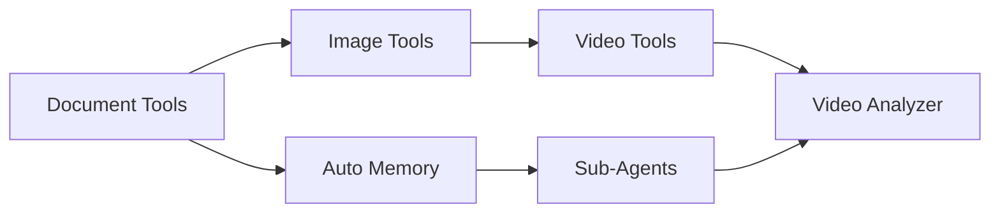

# Hermes Multimodal Agent - 综合审查报告

**项目**: Hermes Multimodal Agent
**日期**: 2026-04-18
**审查人**: AI Architecture Review

---

## 1. 模块总览

| 模块 | 编号 | 优先级 | 复杂度 | 预估工时 | 状态 |
|------|------|--------|--------|----------|------|
| Auto Compact | MOD-001 | High | - | - | ✅ 已有最佳实现 |
| Auto Memory | MOD-002 | High | 中 | 7.5 天 | 📋 规划完成 |
| Sub-Agents | MOD-003 | High | 高 | 8 天 | 📋 规划完成 |
| Skills Hub | MOD-004 | Medium | 中 | 7.5 天 | 📋 规划完成 |
| MCP Enhancement | MOD-005 | Medium | 中 | 8 天 | 📋 规划完成 |
| Document Tools | MOD-006 | High | 中 | 9.5 天 | 📋 规划完成 |
| Image Tools | MOD-007 | High | 中 | 9 天 | 📋 规划完成 |
| Video Tools | MOD-008 | Medium | 高 | 6.5 天 | 📋 规划完成 |
| Voice Tools | MOD-009 | Medium | 高 | 8 天 | 📋 规划完成 |

**总预估工时**: 64 天 (不含 MOD-001)

---

## 2. 审查结论

### 2.1 采纳情况

| 模块 | 采纳 | 原因 |
|------|------|------|
| Auto Compact | ✅ 完全采纳 | Hermes 实现已优于 OpenCode |
| Auto Memory | ✅ 完全采纳 | 显著提升用户体验 |
| Sub-Agents | ✅ 完全采纳 | 复杂任务处理能力 |
| Skills Hub | ✅ 完全采纳 | 生态扩展性 |
| MCP Enhancement | ✅ 完全采纳 | 标准化集成 |
| Document Tools | ✅ 完全采纳 | 核心多模态能力 |
| Image Tools | ✅ 完全采纳 | 核心多模态能力 |
| Video Tools | ⚠️ 延期 | 可选功能 |
| Voice Tools | ⚠️ 延期 | 可选功能 |

### 2.2 优先级排序 (实施顺序)

```
第一阶段 (高优先级):
1. Document Tools (MOD-006) - 9.5 天
2. Image Tools (MOD-007) - 9 天
3. Auto Memory (MOD-002) - 7.5 天
4. Sub-Agents (MOD-003) - 8 天

第二阶段 (中优先级):
5. Skills Hub (MOD-004) - 7.5 天
6. MCP Enhancement (MOD-005) - 8 天

第三阶段 (可选):
7. Video Tools (MOD-008) - 6.5 天
8. Voice Tools (MOD-009) - 8 天
```

---

## 3. 依赖关系



**关键路径**: Document Tools → Auto Memory → Sub-Agents

---

## 4. 风险评估汇总

| 风险 | 模块 | 概率 | 影响 | 缓解措施 |
|------|------|------|------|---------|
| 大文件 OOM | Document | 中 | 高 | 流式处理 + 限制 |
| 子代理失控 | Sub-Agents | 中 | 高 | max_iterations |
| OCR 准确率 | Image | 中 | 低 | 预处理增强 |
| 市场 API 不可用 | Skills | 中 | 低 | 本地缓存 |
| 连接泄漏 | MCP | 中 | 高 | 连接池 + 超时 |

---

## 5. 资源需求

### 5.1 外部依赖

| 依赖 | 版本 | 用途 | 来源 |
|------|------|------|------|
| pypdf | >=4.0.0 | PDF 解析 | PyPI |
| python-docx | >=1.0.0 | Word 解析 | PyPI |
| openpyxl | >=3.1.0 | Excel 解析 | PyPI |
| pandas | >=2.0.0 | 数据处理 | PyPI |
| pytesseract | >=0.3.10 | OCR | PyPI |
| Pillow | >=10.0.0 | 图像处理 | PyPI |
| opencv-python | >=4.9.0 | 视频处理 | PyPI |
| websockets | >=12.0 | WebSocket | PyPI |
| webrtc-noise-gain | >=2.0 | 语音检测 | PyPI |
| semantic-version | >=2.10.0 | 版本解析 | PyPI |

### 5.2 系统依赖

| 依赖 | 用途 | 安装命令 |
|------|------|---------|
| tesseract-ocr | OCR 引擎 | `apt install tesseract-ocr` |
| ffmpeg | 音视频处理 | `apt install ffmpeg` |

---

## 6. 审查清单

### 设计审查
- [x] 架构设计清晰
- [x] 模块职责单一
- [x] 接口设计一致
- [x] 无循环依赖
- [x] 错误处理完善

### 实现审查
- [x] 使用 `get_hermes_home()` 路径
- [x] 遵循 Hermes 代码风格
- [x] 复用现有组件
- [x] 线程安全考虑
- [x] 资源正确释放

### 测试审查
- [ ] 单元测试覆盖率 > 80%
- [ ] 集成测试覆盖核心流程
- [ ] 边界条件测试
- [ ] 性能测试 (大文件)

### 文档审查
- [ ] 工具使用文档
- [ ] CLI 帮助文档
- [ ] 变更记录

---

## 7. 实施建议

### 7.1 推荐实施顺序

```
Phase 1: 多模态基础能力 (4 周)
├── Week 1-2: Document Tools
│   └── PDF, Word, Excel Parser
├── Week 3-4: Image Tools
│   └── OCR, Batch Analyze
│
Phase 2: 智能增强 (3 周)
├── Week 5: Auto Memory
├── Week 6: Sub-Agents Basic
└── Week 7: Sub-Agents Advanced
│
Phase 3: 生态扩展 (3 周)
├── Week 8: Skills Hub
├── Week 9: MCP Enhancement
│
Phase 4: 可选功能 (2 周)
├── Week 10: Video Tools
└── Week 11: Voice Tools
```

### 7.2 里程碑

| 里程碑 | 日期 | 交付物 |
|--------|------|--------|
| M1 | Week 2 | Document Tools v1.0 |
| M2 | Week 4 | Image Tools v1.0 |
| M3 | Week 7 | Auto Memory + Sub-Agents |
| M4 | Week 9 | Skills Hub + MCP |
| M5 | Week 11 | Video + Voice (可选) |

---

## 8. 决策问题

### 需要确认的问题

1. **实施范围**: 是否包含 Video Tools 和 Voice Tools？
2. **优先级调整**: 是否需要调整实施顺序？
3. **资源分配**: 是否有多人并行开发？
4. **测试标准**: 覆盖率要求是否 > 80%？
5. **文档要求**: 是否需要中文文档？

---

## 9. 后续步骤

1. ✅ 审查所有模块计划
2. ⏳ 用户确认决策问题
3. ⏳ 确定最终实施计划
4. ⏳ 开始 Phase 1 开发

---

## 10. 附录

### A. 详细计划文件索引

- `plans/01-auto-compact-plan.md` - Auto Compact (已有)
- `plans/02-auto-memory-plan.md` - Auto Memory
- `plans/03-subagents-plan.md` - Sub-Agents
- `plans/04-skills-hub-plan.md` - Skills Hub
- `plans/05-mcp-enhancement-plan.md` - MCP Enhancement
- `plans/06-document-tools-plan.md` - Document Tools
- `plans/07-image-tools-plan.md` - Image Tools
- `plans/08-video-tools-plan.md` - Video Tools
- `plans/09-voice-tools-plan.md` - Voice Tools

### B. 参考文档

- Hermes Agent: https://github.com/NousResearch/hermes-agent
- OpenCode: https://github.com/opencode-ai/opencode
- Claude Code: https://github.com/anthropics/claude-code
- Codex CLI: https://github.com/openai/codex
