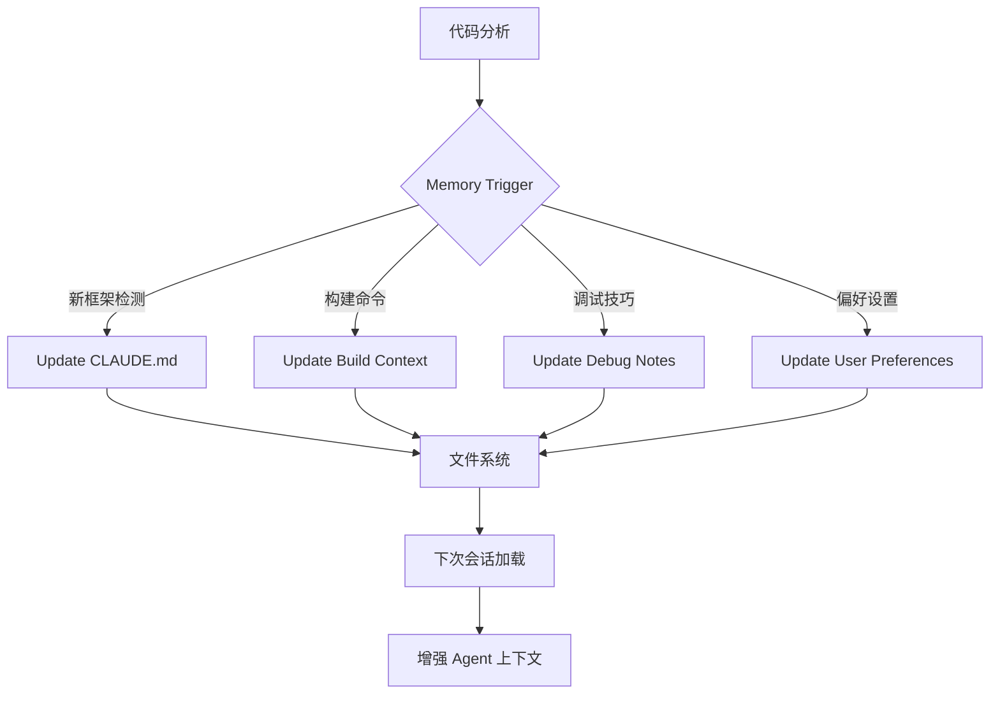

# Plan: Auto Memory System (自动记忆系统)

**模块编号**: MOD-002
**优先级**: High
**状态**: 规划中
**借鉴来源**: Claude Code Auto Memory

---

## 1. 功能描述

Auto Memory 是 Claude Code 引入的一个特性，Agent 能够自动学习项目知识并在跨会话中保留。具体包括：
- 自动检测项目框架和模式
- 学习构建命令和依赖管理
- 记住调试技巧和常见问题
- 跨会话持久化

---

## 2. 现有 Hermes 能力分析

### 已有能力
| 功能 | 文件 | 状态 |
|------|------|------|
| Memory Tool | `tools/memory_tool.py` | ✅ 已有 |
| Context Files | `agent/prompt_builder.py` | ✅ 已有 |
| Session Search | `tools/session_search_tool.py` | ✅ 已有 |
| User Modeling | `honcho` 集成 | ✅ 已有 |

### 差距分析
| 需求 | Hermes 现状 | 需要增强 |
|------|------------|---------|
| 自动学习项目模式 | ❌ 无自动检测 | 新增 |
| 学习构建命令 | ❌ 手动记录 | 增强 |
| 跨会话项目知识 | ⚠️ 部分支持 | 增强 |
| 项目上下文文件 | ✅ CLAUDE.md | 已有但可增强 |

---

## 3. 详细设计方案

### 3.1 架构设计



### 3.2 核心组件

```python
# agent/auto_memory.py

class AutoMemory:
    """自动记忆系统 - 检测并学习项目知识"""
    
    TRIGGER_PATTERNS = {
        "framework": [
            r"package\.json.*scripts",
            r"requirements\.txt",
            r"go\.mod",
            r"Cargo\.toml",
            r"pom\.xml",
            r"Gemfile",
        ],
        "build_command": [
            r"npm install",
            r"pip install",
            r"go build",
            r"cargo build",
            r"mvn compile",
        ],
        "test_command": [
            r"pytest",
            r"npm test",
            r"go test",
            r"cargo test",
        ],
    }
    
    def __init__(self, hermes_home: Path):
        self.memory_dir = hermes_home / "auto_memory"
        self.project_cache = {}  # project_path -> MemorySnapshot
        
    def should_learn(self, context: Dict) -> bool:
        """判断是否应该学习当前上下文"""
        pass
    
    def learn(self, context: Dict) -> None:
        """从当前上下文学习知识"""
        pass
    
    def get_memory(self, project_path: Path) -> Dict:
        """获取项目的记忆"""
        pass
```

### 3.3 记忆类型

| 记忆类型 | 存储位置 | 触发条件 | 内容示例 |
|---------|---------|---------|---------|
| 项目框架 | `CLAUDE.md` | 检测到框架文件 | "这是一个 React + TypeScript 项目" |
| 构建命令 | `CLAUDE.md` | 执行构建命令 | "使用 `npm run dev` 启动开发服务器" |
| 调试技巧 | `.hermes/auto_memory/debug_notes.md` | 发现并解决 bug | "这个模块的常见错误是..." |
| 代码模式 | `.hermes/auto_memory/patterns.md` | 多次看到相同模式 | "该模块使用 Repository 模式" |
| 用户偏好 | `USER.md` | 用户明确指示 | "用户偏好使用 async/await" |

---

## 4. 实施步骤

### Step 1: 创建基础架构

**文件**: `agent/auto_memory.py` (新建)

```python
# 实现内容
- AutoMemory class
- MemorySnapshot dataclass
- should_learn() 方法
- learn() 方法  
- get_memory() 方法
```

**验收标准**:
- [ ] AutoMemory 类可以实例化
- [ ] 内存目录正确创建
- [ ] 基础方法签名符合设计

### Step 2: 实现模式检测

**文件**: `agent/auto_memory.py` (增强)

```python
# 新增内容
- detect_framework() - 检测项目框架
- detect_build_commands() - 检测构建命令
- detect_coding_patterns() - 检测代码模式
- update_project_memory() - 更新项目记忆
```

**验收标准**:
- [ ] 能检测 React/Vue/Angular 项目
- [ ] 能检测 Python/Go/Node 项目
- [ ] 能从 package.json 提取 scripts

### Step 3: 集成到 Agent 循环

**文件**: `run_agent.py` (修改)

```python
# 修改内容
- 在 session 初始化时加载 AutoMemory
- 在工具执行后检查是否触发学习
- 在 context 构建时包含项目记忆
```

**验收标准**:
- [ ] 新会话自动加载项目记忆
- [ ] 工具执行后触发模式检测
- [ ] 系统提示词包含项目记忆

### Step 4: 实现记忆持久化

**文件**: `agent/auto_memory.py` (增强)

```python
# 新增内容
- save_memory() - 保存记忆到文件系统
- load_memory() - 从文件系统加载记忆
- clear_memory() - 清除项目记忆
```

**验收标准**:
- [ ] 记忆正确保存到 `.hermes/auto_memory/`
- [ ] 新会话能恢复项目记忆
- [ ] 可以主动清除记忆

### Step 5: CLI 命令集成

**文件**: `hermes_cli/commands.py` (修改)

**新增命令**:
```
/memory          - 查看当前项目记忆
/memory clear   - 清除当前项目记忆  
/memory disable - 禁用自动记忆
/memory enable  - 启用自动记忆
```

**验收标准**:
- [ ] 命令正确注册
- [ ] 可以查看/清除/启用/禁用

---

## 5. 测试计划

### 单元测试

**文件**: `tests/agent/test_auto_memory.py`

| 测试用例 | 输入 | 期望输出 |
|---------|------|---------|
| test_should_learn_framework | package.json 存在 | True |
| test_should_learn_build_command | 执行 npm install | True |
| test_should_not_learn_duplicates | 重复模式 | False |
| test_save_and_load_memory | 正常保存加载 | Memory 一致 |
| test_detect_react_project | React 项目结构 | framework="react" |
| test_detect_python_project | Python 项目结构 | framework="python" |

### 集成测试

| 测试用例 | 步骤 | 期望 |
|---------|------|------|
| test_memory_persistence | 1. 创建记忆 2. 重启 3. 加载 | 记忆恢复 |
| test_memory_in_context | 1. 学习项目 2. 新会话 | 上下文包含记忆 |
| test_memory_aggregation | 多次学习 | 记忆累积 |

---

## 6. 审查清单

### 设计审查
- [ ] 架构设计是否清晰
- [ ] 是否有循环依赖风险
- [ ] 是否与现有 Hermes 组件冲突
- [ ] 记忆存储格式是否合理

### 实现审查
- [ ] 代码是否符合 Hermes 代码风格
- [ ] 是否使用 `get_hermes_home()` 路径
- [ ] 错误处理是否完善
- [ ] 是否有内存泄漏风险

### 测试审查
- [ ] 单元测试覆盖率 > 80%
- [ ] 集成测试覆盖核心流程
- [ ] 边界条件是否测试

### 文档审查
- [ ] 是否有使用文档
- [ ] 是否有 CLI 帮助
- [ ] 变更是否记录

---

## 7. 风险评估

| 风险 | 概率 | 影响 | 缓解措施 |
|------|------|------|---------|
| 记忆膨胀 | 中 | 中 | 设置记忆大小限制 |
| 误学错误模式 | 中 | 高 | 仅在多次确认后学习 |
| 隐私泄露 | 低 | 高 | 不存储敏感内容 |
| 与现有 Memory 冲突 | 低 | 中 | 复用现有组件 |

---

## 8. 依赖项

| 依赖 | 来源 | 用途 |
|------|------|------|
| `pathlib.Path` | Python stdlib | 路径处理 |
| `json` | Python stdlib | 序列化 |
| `logging` | Python stdlib | 日志记录 |
| `re` | Python stdlib | 模式匹配 |

无新增外部依赖。

---

## 9. 预估工作量

| 步骤 | 预估时间 | 复杂度 |
|------|---------|--------|
| Step 1: 基础架构 | 1 天 | 低 |
| Step 2: 模式检测 | 2 天 | 中 |
| Step 3: Agent 集成 | 1 天 | 中 |
| Step 4: 持久化 | 1 天 | 低 |
| Step 5: CLI 集成 | 0.5 天 | 低 |
| 测试与修复 | 2 天 | 中 |
| **总计** | **7.5 天** | - |

---

## 10. 后续优化

1. **智能记忆合并** - 当多个项目有相似模式时合并
2. **记忆索引** - 支持语义搜索记忆
3. **记忆导出/导入** - 跨机器迁移
4. **记忆可视化** - 查看记忆内容
