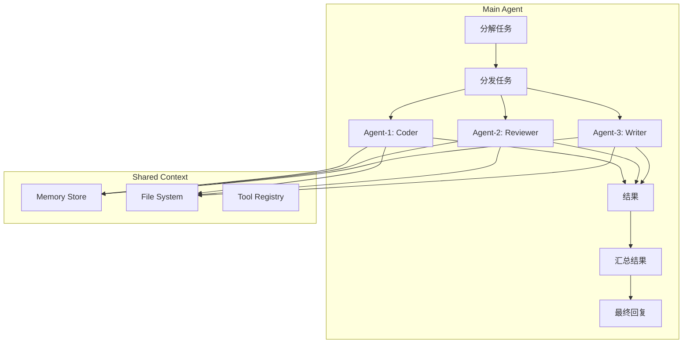

# Plan: Sub-Agents Enhancement (子代理增强)

**模块编号**: MOD-003
**优先级**: High
**状态**: 规划中
**借鉴来源**: Claude Code Sub-Agents

---

## 1. 功能描述

Sub-Agents 允许主 Agent 将复杂任务分解为多个子任务，并行分发给专门的子代理执行。Claude Code 的实现支持：
- 任务分解和分发
- 专业分工（coder/reviewer/writer）
- 结果汇总和整合
- 跨代理共享上下文

---

## 2. 现有 Hermes 能力分析

### 已有能力
| 功能 | 文件 | 状态 |
|------|------|------|
| delegate_tool | `tools/delegate_tool.py` | ✅ 已有 |
| Sub-Agent 执行 | `run_agent.py` | ✅ 已有 |
| 多会话管理 | `hermes_state.py` | ✅ 已有 |
| Tool Calling | `model_tools.py` | ✅ 已有 |

### 差距分析
| 需求 | Hermes 现状 | 需要增强 |
|------|------------|---------|
| 专业分工 | ❌ 无 agent type | 新增 |
| 并行执行 | ⚠️ 基本支持 | 增强 |
| 结果汇总 | ❌ 手动汇总 | 新增 |
| 共享内存 | ❌ 隔离 | 新增 |

---

## 3. 详细设计方案

### 3.1 架构设计



### 3.2 核心组件

```python
# tools/delegate_tool.py (增强)

class AgentType(Enum):
    """子代理专业类型"""
    GENERAL = "general"      # 综合处理
    CODER = "coder"         # 代码开发
    REVIEWER = "reviewer"   # 代码审查
    WRITER = "writer"       # 文档撰写
    RESEARCHER = "researcher"  # 研究搜索


@dataclass
class SubAgentConfig:
    """子代理配置"""
    agent_type: AgentType = AgentType.GENERAL
    max_iterations: int = 50
    tools: List[str] = None  # 允许的工具列表
    system_prompt: str = None  # 自定义系统提示
    share_memory: bool = True  # 共享记忆


def delegate_task_tool(
    task: str,
    agent_type: str = "general",
    max_iterations: int = 50,
    tools: List[str] = None,
    task_id: str = None,
) -> str:
    """
    增强的子代理分发工具
    
    新增功能:
    - agent_type: 专业分工
    - tools: 限制子代理可用工具
    - share_memory: 是否共享主代理记忆
    """
```

### 3.3 专业提示词模板

```python
# agent/subagent_prompts.py

AGENT_PROMPTS = {
    AgentType.CODER: """You are a code specialist. Your task is to {task}.

Guidelines:
- Write clean, maintainable code
- Follow the project's coding standards
- Include tests for your changes
- Document non-obvious decisions
- Return ONLY code changes, no explanations""",

    AgentType.REVIEWER: """You are a code review specialist. Your task is to {task}.

Guidelines:
- Focus on code quality and potential bugs
- Check for security vulnerabilities
- Verify test coverage
- Look for performance issues
- Provide specific, actionable feedback""",

    AgentType.WRITER: """You are a technical documentation specialist. Your task is to {task}.

Guidelines:
- Write clear, concise documentation
- Use appropriate technical terminology
- Include code examples where relevant
- Follow documentation best practices""",

    AgentType.RESEARCHER: """You are a research specialist. Your task is to {task}.

Guidelines:
- Search for relevant information
- Evaluate source credibility
- Synthesize findings
- Cite sources appropriately"""
}
```

---

## 4. 实施步骤

### Step 1: 扩展 delegate_tool

**文件**: `tools/delegate_tool.py`

```python
# 新增内容
- AgentType Enum
- SubAgentConfig dataclass
- enhance delegate_task_tool() 支持 agent_type
```

**验收标准**:
- [ ] AgentType 枚举定义正确
- [ ] agent_type 参数生效
- [ ] 不同类型代理使用不同提示词

### Step 2: 实现共享内存

**文件**: `agent/subagent_memory.py` (新建)

```python
# 实现内容
class SubAgentMemory:
    """子代理共享内存"""
    
    def __init__(self, parent_task_id: str):
        self.task_id = parent_task_id
        self.store = {}  # key -> value
        self.locks = {}  # key -> threading.Lock
    
    def set(self, key: str, value: Any) -> None:
        """设置共享值"""
    
    def get(self, key: str, default: Any = None) -> Any:
        """获取共享值"""
    
    def append(self, key: str, value: Any) -> None:
        """追加到列表"""
    
    def get_all(self) -> Dict[str, Any]:
        """获取所有共享数据"""
```

**验收标准**:
- [ ] 多个子代理可读写共享内存
- [ ] 线程安全
- [ ] 主代理可读取子代理写入的数据

### Step 3: 实现结果汇总

**文件**: `agent/subagent_aggregator.py` (新建)

```python
# 实现内容
class ResultAggregator:
    """子代理结果汇总器"""
    
    def aggregate(self, results: List[SubAgentResult]) -> str:
        """汇总多个子代理的结果"""
    
    def resolve_conflicts(self, results: List[SubAgentResult]) -> List[SubAgentResult]:
        """解决子代理结果冲突"""
```

**验收标准**:
- [ ] 正确汇总多个结果
- [ ] 识别冲突结果
- [ ] 生成汇总报告

### Step 4: CLI 命令增强

**文件**: `hermes_cli/commands.py`

**新增命令**:
```
/delegate <task> --type=coder    # 分发给 coder
/delegate <task> --type=reviewer # 分发给 reviewer
/agents                          # 查看活跃子代理
/agents kill <id>                # 终止子代理
```

**验收标准**:
- [ ] 新命令正确注册
- [ ] 子代理管理功能正常

### Step 5: 并行执行引擎

**文件**: `agent/parallel_executor.py` (新建)

```python
# 实现内容
class ParallelExecutor:
    """并行任务执行器"""
    
    def execute_parallel(
        self,
        tasks: List[Task],
        max_concurrent: int = 3,
    ) -> List[TaskResult]:
        """并行执行多个任务"""
    
    def execute_sequential(
        self,
        tasks: List[Task],
    ) -> List[TaskResult]:
        """顺序执行多个任务"""
```

**验收标准**:
- [ ] 支持并行执行
- [ ] 可配置并发数
- [ ] 正确处理超时

---

## 5. 测试计划

### 单元测试

**文件**: `tests/tools/test_delegate_tool.py`

| 测试用例 | 输入 | 期望输出 |
|---------|------|---------|
| test_agent_type_coder | coder 类型任务 | 使用 coder 提示词 |
| test_agent_type_reviewer | reviewer 类型任务 | 使用 reviewer 提示词 |
| test_shared_memory_set | 设置共享值 | 可被其他代理读取 |
| test_result_aggregation | 多个子结果 | 正确汇总 |

### 集成测试

| 测试用例 | 步骤 | 期望 |
|---------|------|------|
| test_parallel_execution | 并行执行 3 个任务 | 正确汇总结果 |
| test_sequential_execution | 顺序执行 3 个任务 | 正确汇总结果 |
| test_subagent_timeout | 子代理超时 | 正确处理超时 |

---

## 6. 审查清单

### 设计审查
- [ ] AgentType 分类是否合理
- [ ] 共享内存设计是否线程安全
- [ ] 结果汇总逻辑是否正确

### 实现审查
- [ ] 是否复用现有 delegate_tool
- [ ] 错误处理是否完善
- [ ] 是否有资源泄漏风险

### 测试审查
- [ ] 并发测试是否覆盖
- [ ] 超时处理是否测试
- [ ] 结果冲突是否测试

---

## 7. 风险评估

| 风险 | 概率 | 影响 | 缓解措施 |
|------|------|------|---------|
| 子代理失控 | 中 | 高 | max_iterations 限制 |
| 资源耗尽 | 中 | 中 | 并发数限制 |
| 结果冲突 | 高 | 中 | 冲突解决机制 |
| 内存泄漏 | 低 | 中 | 使用上下文管理器 |

---

## 8. 依赖项

| 依赖 | 来源 | 用途 |
|------|------|------|
| `threading` | Python stdlib | 线程安全 |
| `concurrent.futures` | Python stdlib | 并行执行 |
| `dataclass` | Python stdlib | 数据结构 |

无新增外部依赖。

---

## 9. 预估工作量

| 步骤 | 预估时间 | 复杂度 |
|------|---------|--------|
| Step 1: 扩展 delegate_tool | 1 天 | 低 |
| Step 2: 共享内存 | 1.5 天 | 中 |
| Step 3: 结果汇总 | 1 天 | 中 |
| Step 4: CLI 增强 | 0.5 天 | 低 |
| Step 5: 并行执行器 | 2 天 | 高 |
| 测试与修复 | 2 天 | 中 |
| **总计** | **8 天** | - |

---

## 10. 使用示例

```python
# 示例 1: 简单任务分发
result = delegate_task_tool(
    task="修复登录页面的 CSS 问题",
    agent_type="coder"
)

# 示例 2: 并行多类型处理
result = delegate_task_tool(
    task="审查用户模块代码并更新文档",
    agent_type="general",
    parallel=True,
    sub_tasks=[
        {"type": "reviewer", "task": "审查用户模块代码"},
        {"type": "writer", "task": "更新用户模块文档"}
    ]
)

# 示例 3: 带共享内存的分发
result = delegate_task_tool(
    task="分析并优化性能",
    agent_type="general",
    share_memory=True,
    shared_context={"focus_module": "api/v1/users"}
)
```
