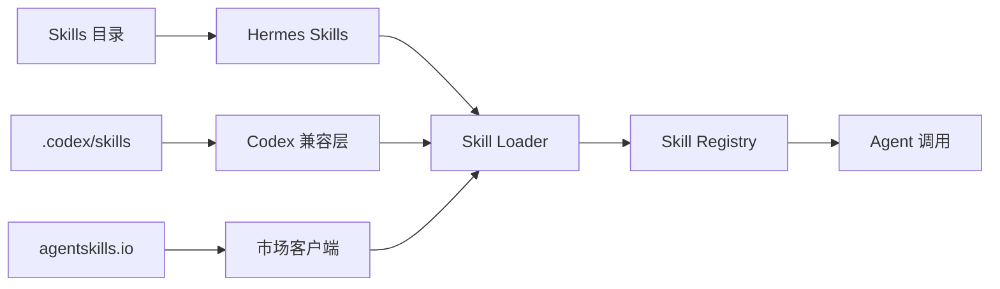

# Plan: Skills Hub Enhancement (技能中心增强)

**模块编号**: MOD-004
**优先级**: Medium
**状态**: 规划中
**借鉴来源**: Codex Skills + OpenCode Custom Commands

---

## 1. 功能描述

Skills Hub 是 Hermes 的技能管理系统。增强后将支持：
- `.codex/skills` 格式兼容
- agentskills.io 社区技能市场
- 自定义命令参数
- 技能版本管理
- 技能市场浏览和安装

---

## 2. 现有 Hermes 能力分析

### 已有能力
| 功能 | 文件 | 状态 |
|------|------|------|
| Skills 目录 | `skills/` | ✅ 已有 |
| Skill 命令 | `hermes_cli/skills_hub.py` | ✅ 已有 |
| Skill 注册 | `agent/skill_commands.py` | ✅ 已有 |

### 差距分析
| 需求 | Hermes 现状 | 需要增强 |
|------|------------|---------|
| Codex 格式兼容 | ❌ 不支持 | 新增 |
| 社区市场 | ⚠️ 基础 | 增强 |
| 命令参数 | ❌ 不支持 | 新增 |
| 版本管理 | ❌ 无 | 新增 |

---

## 3. 详细设计方案

### 3.1 架构设计



### 3.2 技能结构

```python
# skill 结构
skill_name/
├── SKILL.md           # 主定义文件
├── instructions.md     # 详细指令
├── examples/          # 使用示例
│   ├── example1.md
│   └── example2.md
├── resources/         # 资源文件
│   └── template.md
└── .skill-version     # 版本文件 (新增)
```

### 3.3 SKILL.md 格式

```markdown
# Skill Name

## Description
Brief description of the skill.

## Parameters  (新增)
| Parameter | Type | Required | Description |
|-----------|------|----------|-------------|
| file_path | string | Yes | Path to file |
| option | string | No | Optional parameter |

## Triggers
- `/skill_name`
- `when doing X, use skill_name`

## Instructions
Detailed instructions for the agent...

## Examples
Example usage of the skill...
```

### 3.4 市场集成

```python
# hermes_cli/marketplace.py (新增)

class SkillMarketplace:
    """技能市场客户端"""
    
    MARKETPLACE_URL = "https://agentskills.io/api/skills"
    
    def browse(self, category: str = None) -> List[SkillListing]:
        """浏览市场技能"""
    
    def install(self, skill_id: str, target_dir: Path) -> None:
        """安装技能"""
    
    def search(self, query: str) -> List[SkillListing]:
        """搜索技能"""
    
    def get_updates(self, skill_id: str) -> Optional[VersionInfo]:
        """检查更新"""
```

---

## 4. 实施步骤

### Step 1: Codex 兼容层

**文件**: `hermes_cli/codex_compat.py` (新建)

```python
# 实现内容
- CodexSkillLoader class
- 解析 .codex/skills 格式
- 转换为 Hermes Skill 格式
```

**验收标准**:
- [ ] 能加载 .codex/skills 格式
- [ ] 参数定义正确解析
- [ ] 示例代码正确运行

### Step 2: 参数系统

**文件**: `hermes_cli/skills_config.py` (增强)

```python
# 新增内容
- SkillParameter dataclass
- 参数验证逻辑
- 交互式参数输入
```

**验收标准**:
- [ ] 技能可定义参数
- [ ] 参数验证正常
- [ ] 交互式输入正常

### Step 3: 市场客户端

**文件**: `hermes_cli/marketplace.py` (新建)

```python
# 实现内容
- SkillMarketplace class
- browse(), search(), install() 方法
- 版本检查和更新
```

**验收标准**:
- [ ] 能浏览市场技能
- [ ] 能安装技能
- [ ] 版本检查正常

### Step 4: CLI 命令增强

**文件**: `hermes_cli/commands.py`

**新增命令**:
```
/skills browse           # 浏览市场
/skills install <id>    # 安装技能
/skills update <name>   # 更新技能
/skills publish <name>  # 发布技能 (需要配置)
/skills versions        # 查看版本信息
```

**验收标准**:
- [ ] 新命令正确注册
- [ ] 市场浏览正常
- [ ] 安装/更新正常

### Step 5: 技能版本管理

**文件**: `hermes_cli/skill_version.py` (新建)

```python
# 实现内容
- SkillVersionManager class
- .skill-version 文件处理
- 版本兼容性检查
```

**验收标准**:
- [ ] 版本号正确读写
- [ ] 兼容版本检测
- [ ] 更新提示正常

---

## 5. 测试计划

### 单元测试

**文件**: `tests/hermes_cli/test_skills.py`

| 测试用例 | 输入 | 期望输出 |
|---------|------|---------|
| test_load_codex_skill | .codex/skills 格式 | 正确加载 |
| test_skill_parameter_validation | 无效参数 | 抛出错误 |
| test_marketplace_browse | 搜索 "python" | 返回列表 |

### 集成测试

| 测试用例 | 步骤 | 期望 |
|---------|------|------|
| test_skill_install_flow | 浏览→安装→使用 | 技能可用 |
| test_version_update | 安装旧版→检查更新 | 提示更新 |

---

## 6. 审查清单

### 设计审查
- [ ] Codex 兼容层设计合理
- [ ] 参数系统设计完善
- [ ] 市场 API 集成安全

### 实现审查
- [ ] 网络错误处理完善
- [ ] 文件权限正确处理
- [ ] 磁盘空间检查

---

## 7. 风险评估

| 风险 | 概率 | 影响 | 缓解措施 |
|------|------|------|---------|
| 市场 API 不可用 | 中 | 低 | 本地缓存 |
| 恶意技能 | 低 | 高 | 签名验证 |
| 版本冲突 | 中 | 中 | 依赖检查 |

---

## 8. 依赖项

| 依赖 | 来源 | 用途 |
|------|------|------|
| `requests` | 已有 | HTTP 请求 |
| `semantic-version` | 新增 | 版本解析 |

**新增依赖**: `semantic-version>=2.10.0`

---

## 9. 预估工作量

| 步骤 | 预估时间 | 复杂度 |
|------|---------|--------|
| Step 1: Codex 兼容层 | 1 天 | 中 |
| Step 2: 参数系统 | 1.5 天 | 中 |
| Step 3: 市场客户端 | 2 天 | 中 |
| Step 4: CLI 增强 | 0.5 天 | 低 |
| Step 5: 版本管理 | 1 天 | 中 |
| 测试与修复 | 1.5 天 | 中 |
| **总计** | **7.5 天** | - |
