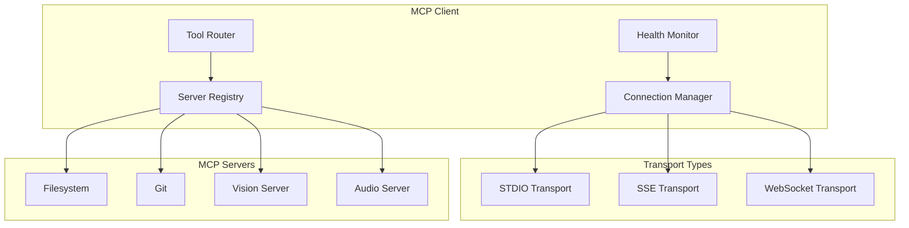

# Plan: MCP Protocol Enhancement (MCP 协议增强)

**模块编号**: MOD-005
**优先级**: Medium
**状态**: 规划中
**借鉴来源**: OpenCode MCP + Claude Code MCP

---

## 1. 功能描述

MCP (Model Context Protocol) 是连接 AI Agent 与外部工具的开放标准。增强后将支持：
- 多 MCP 服务器连接管理
- 自动服务发现
- 连接状态监控
- 重连机制
- 多模态 MCP 服务器

---

## 2. 现有 Hermes 能力分析

### 已有能力
| 功能 | 文件 | 状态 |
|------|------|------|
| MCP 客户端 | `tools/mcp_tool.py` | ✅ 已有 |
| MCP 配置 | `hermes_cli/mcp_config.py` | ✅ 已有 |
| STDIO 连接 | `tools/mcp_tool.py` | ✅ 已有 |

### 差距分析
| 需求 | Hermes 现状 | 需要增强 |
|------|------------|---------|
| SSE 连接 | ❌ 不支持 | 新增 |
| 服务发现 | ❌ 手动配置 | 增强 |
| 连接监控 | ❌ 无 | 新增 |
| 多模态 MCP | ❌ 无 | 新增 |

---

## 3. 详细设计方案

### 3.1 架构设计



### 3.2 核心组件

```python
# tools/mcp_tool.py (增强)

class MCPTransport(Enum):
    """传输类型"""
    STDIO = "stdio"
    SSE = "sse"
    WEBSOCKET = "websocket"


@dataclass
class MCPServerConfig:
    """MCP 服务器配置"""
    name: str
    transport: MCPTransport = MCPTransport.STDIO
    command: str = None
    args: List[str] = None
    env: Dict[str, str] = None
    url: str = None  # For SSE/WebSocket
    headers: Dict[str, str] = None
    auto_reconnect: bool = True
    health_check_interval: int = 30


class MCPConnectionManager:
    """MCP 连接管理器"""
    
    def __init__(self):
        self.servers: Dict[str, MCPServerConfig] = {}
        self.connections: Dict[str, MCPConnection] = {}
        self.health_checks: Dict[str, HealthStatus] = {}
    
    def connect(self, server_name: str) -> MCPConnection:
        """连接到 MCP 服务器"""
    
    def disconnect(self, server_name: str) -> None:
        """断开 MCP 服务器"""
    
    def get_tools(self, server_name: str) -> List[ToolDefinition]:
        """获取服务器提供的工具"""
    
    def health_check(self, server_name: str) -> HealthStatus:
        """健康检查"""
    
    def auto_reconnect(self, server_name: str) -> None:
        """自动重连"""
```

### 3.3 多模态 MCP 服务器配置

```yaml
# config.yaml
mcpServers:
  filesystem:
    type: stdio
    command: npx
    args: ["-y", "@modelcontextprotocol/server-filesystem", "/path/to/dir"]
  
  vision:
    type: sse
    url: http://localhost:8080/mcp
    auto_reconnect: true
  
  document:
    type: websocket
    url: ws://localhost:8081/mcp
    headers:
      Authorization: "Bearer ${DOCUMENT_API_KEY}"
```

---

## 4. 实施步骤

### Step 1: 传输层抽象

**文件**: `tools/mcp_transport.py` (新建)

```python
# 实现内容
- MCPTransport 基类
- StdioTransport 实现
- SSETransport 实现
- WebSocketTransport 实现
```

**验收标准**:
- [ ] 三种传输方式可用
- [ ] 传输层可切换
- [ ] 错误处理完善

### Step 2: 连接管理器

**文件**: `tools/mcp_connection.py` (新建)

```python
# 实现内容
- MCPConnectionManager class
- connect/disconnect 方法
- 连接池管理
```

**验收标准**:
- [ ] 多服务器连接管理
- [ ] 连接复用
- [ ] 正确资源释放

### Step 3: 健康监控

**文件**: `tools/mcp_health.py` (新建)

```python
# 实现内容
- HealthMonitor class
- 健康检查定时任务
- 自动重连逻辑
```

**验收标准**:
- [ ] 定时健康检查
- [ ] 断线自动重连
- [ ] 状态变化通知

### Step 4: SSE/WebSocket 支持

**文件**: `tools/mcp_tool.py` (增强)

```python
# 新增内容
- SSETransport class
- WebSocketTransport class
- 配置解析增强
```

**验收标准**:
- [ ] SSE 连接正常
- [ ] WebSocket 连接正常
- [ ] Header 传递正确

### Step 5: CLI 管理命令

**文件**: `hermes_cli/commands.py`

**新增命令**:
```
/mcp list              # 列出 MCP 服务器
/mcp connect <name>    # 连接服务器
/mcp disconnect <name>  # 断开服务器
/mcp health <name>     # 健康检查
/mcp config           # 编辑 MCP 配置
```

**验收标准**:
- [ ] 新命令正确注册
- [ ] 服务器管理正常
- [ ] 健康检查正常

---

## 5. 测试计划

### 单元测试

**文件**: `tests/tools/test_mcp_tool.py`

| 测试用例 | 输入 | 期望输出 |
|---------|------|---------|
| test_stdio_transport | 启动 MCP 服务器 | 正确通信 |
| test_sse_transport | SSE 端点 | 正确连接 |
| test_connection_manager | 管理多连接 | 正确复用 |
| test_health_check | 服务器运行中 | 返回 healthy |

### 集成测试

| 测试用例 | 步骤 | 期望 |
|---------|------|------|
| test_auto_reconnect | 断线后重连 | 自动恢复 |
| test_multi_server | 连接多个服务器 | 正确隔离 |

---

## 6. 审查清单

### 设计审查
- [ ] 传输层抽象合理
- [ ] 连接管理设计完善
- [ ] 重连机制健壮

### 实现审查
- [ ] 资源正确释放
- [ ] 超时处理完善
- [ ] 错误日志清晰

---

## 7. 风险评估

| 风险 | 概率 | 影响 | 缓解措施 |
|------|------|------|---------|
| 连接泄漏 | 中 | 高 | 连接池 + 超时 |
| 重连风暴 | 低 | 中 | 指数退避 |
| 版本不兼容 | 中 | 中 | 版本协商 |

---

## 8. 依赖项

| 依赖 | 来源 | 用途 |
|------|------|------|
| `websockets` | 新增 | WebSocket 客户端 |
| `httpx` | 已有 | HTTP/SSE 客户端 |

**新增依赖**: `websockets>=12.0`

---

## 9. 预估工作量

| 步骤 | 预估时间 | 复杂度 |
|------|---------|--------|
| Step 1: 传输层抽象 | 1.5 天 | 中 |
| Step 2: 连接管理器 | 1.5 天 | 中 |
| Step 3: 健康监控 | 1 天 | 低 |
| Step 4: SSE/WS 支持 | 1.5 天 | 中 |
| Step 5: CLI 命令 | 0.5 天 | 低 |
| 测试与修复 | 2 天 | 中 |
| **总计** | **8 天** | - |
