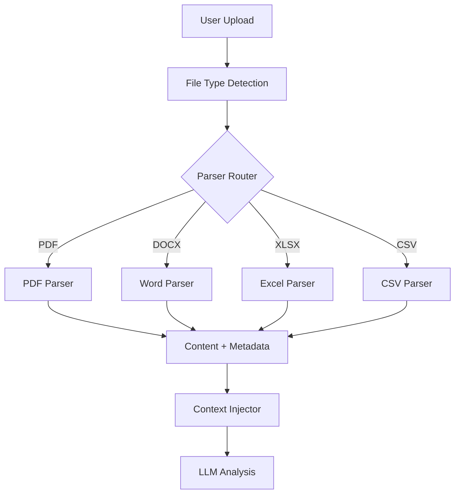

# Plan: Document Processing Tools (文档处理工具)

**模块编号**: MOD-006
**优先级**: High
**状态**: 规划中
**借鉴来源**: 新增功能 (基于 Hermes 工具生态)

---

## 1. 功能描述

文档处理工具让 Agent 能够解析和理解 PDF、Word、Excel 等常见文档格式：
- PDF 解析 - 文本和元数据提取
- Word 解析 - 文本、表格、样式提取
- Excel/CSV 解析 - 表格数据和公式
- 文档索引 - 支持语义搜索

---

## 2. 现有 Hermes 能力分析

### 已有能力
| 功能 | 文件 | 状态 |
|------|------|------|
| File Tools | `tools/file_tools.py` | ✅ 已有 |
| Read File | `tools/file_tools.py` | ✅ 已有 |

### 差距分析
| 需求 | Hermes 现状 | 需要增强 |
|------|------------|---------|
| PDF 解析 | ❌ 只能读文本文件 | 新增 |
| Word 解析 | ❌ 不支持 | 新增 |
| Excel 解析 | ❌ 不支持 | 新增 |
| 文档索引 | ❌ 无 | 新增 |

---

## 3. 详细设计方案

### 3.1 架构设计



### 3.2 核心组件

```python
# tools/pdf_parser_tool.py (新建)

def check_pdf_requirements() -> bool:
    """检查依赖是否满足"""
    return importlib.util.find_spec("pypdf") is not None


def parse_pdf_tool(
    file_path: str,
    max_pages: int = None,
    extract_images: bool = False,
    task_id: str = None,
) -> str:
    """
    解析 PDF 文件
    
    Args:
        file_path: PDF 文件路径
        max_pages: 最大解析页数 (默认全部)
        extract_images: 是否提取图片 (未来功能)
        task_id: 任务 ID
    
    Returns:
        JSON string with success status and content
    """
```

### 3.3 工具注册

```python
# tools/pdf_parser_tool.py (末尾)

registry.register(
    name="parse_pdf",
    toolset="document",
    schema={
        "name": "parse_pdf",
        "description": """Parse and extract text content from PDF files.
        
Use this tool when the user uploads a PDF document and wants to:
- Extract text content for analysis
- Search for specific information in a PDF
- Summarize the PDF content
- Extract metadata (title, author, pages)

The tool returns the full text content and basic metadata.""",
        "parameters": {
            "type": "object",
            "properties": {
                "file_path": {
                    "type": "string",
                    "description": "Path to the PDF file to parse"
                },
                "max_pages": {
                    "type": "integer",
                    "description": "Maximum number of pages to parse (default: all pages)",
                    "default": None
                }
            },
            "required": ["file_path"]
        }
    },
    handler=lambda args, **kw: parse_pdf_tool(
        file_path=args.get("file_path"),
        max_pages=args.get("max_pages"),
        task_id=kw.get("task_id")
    ),
    check_fn=check_pdf_requirements,
    requires_env=[],
)
```

### 3.4 返回格式

```json
{
    "success": true,
    "data": {
        "content": "Full text content of the PDF...",
        "metadata": {
            "title": "Document Title",
            "author": "Author Name",
            "pages": 42,
            "page_count": 42
        },
        "content_type": "text"
    }
}
```

---

## 4. 实施步骤

### Step 1: PDF Parser

**文件**: `tools/pdf_parser_tool.py` (新建)

**依赖**: `pypdf>=4.0.0`

**实现内容**:
- parse_pdf_tool() 函数
- check_pdf_requirements() 函数
- 工具注册

**验收标准**:
- [ ] 能解析文本 PDF
- [ ] 正确提取元数据
- [ ] 支持 max_pages 参数
- [ ] 优雅处理加密 PDF

### Step 2: Word Parser

**文件**: `tools/docx_parser_tool.py` (新建)

**依赖**: `python-docx>=1.0.0`

**实现内容**:
- parse_docx_tool() 函数
- 支持提取表格
- 支持提取图片引用

**验收标准**:
- [ ] 能解析 .docx 文件
- [ ] 表格内容正确提取
- [ ] 段落样式保留

### Step 3: Excel/CSV Parser

**文件**: `tools/spreadsheet_parser_tool.py` (新建)

**依赖**: `openpyxl>=3.1.0`, `pandas>=2.0.0`

**实现内容**:
- parse_spreadsheet_tool() 函数
- 支持 .xlsx, .xls, .csv
- 数据类型转换

**验收标准**:
- [ ] 能解析 Excel 文件
- [ ] 能解析 CSV 文件
- [ ] 表格数据正确提取

### Step 4: Document Index

**文件**: `tools/document_index_tool.py` (新建)

**实现内容**:
- index_document_tool() 函数
- 文档内容向量化
- 语义搜索

**验收标准**:
- [ ] 文档内容正确索引
- [ ] 支持语义搜索
- [ ] 搜索结果相关

### Step 5: Toolset 更新

**文件**: `toolsets.py`

```python
TOOLSETS = {
    # ... existing ...
    
    "document": {
        "description": "Document processing tools: PDF, Word, Excel, CSV parsing",
        "tools": ["parse_pdf", "parse_docx", "parse_spreadsheet", "index_document"],
    },
}
```

**验收标准**:
- [ ] 新工具集正确注册
- [ ] 工具可通过 hermes tools 启用/禁用

---

## 5. 测试计划

### 单元测试

**文件**: `tests/tools/test_pdf_parser.py`

| 测试用例 | 输入 | 期望输出 |
|---------|------|---------|
| test_parse_simple_pdf | 简单 PDF | 正确提取文本 |
| test_parse_protected_pdf | 加密 PDF | 优雅失败 |
| test_metadata_extraction | 带元数据 PDF | 正确提取 |
| test_max_pages | max_pages=2 | 仅返回前2页 |

### 集成测试

| 测试用例 | 步骤 | 期望 |
|---------|------|------|
| test_end_to_end | 上传PDF→解析→对话 | 内容正确 |
| test_batch_documents | 多个文档 | 全部解析 |

---

## 6. 审查清单

### 设计审查
- [ ] Parser 接口设计一致
- [ ] 错误处理完善
- [ ] 依赖检查合理

### 实现审查
- [ ] 使用 `get_hermes_home()` 路径
- [ ] 内存使用合理 (大文件分块)
- [ ] 权限处理正确

### 安全审查
- [ ] 路径遍历防护
- [ ] 文件大小限制
- [ ] 临时文件清理

---

## 7. 风险评估

| 风险 | 概率 | 影响 | 缓解措施 |
|------|------|------|---------|
| 大文件 OOM | 中 | 高 | 流式处理 + 限制 |
| 恶意 PDF | 低 | 高 | 沙箱隔离 |
| 依赖缺失 | 中 | 低 | 优雅提示 |
| 编码错误 | 中 | 低 | 多种编码尝试 |

---

## 8. 依赖项

| 依赖 | 来源 | 用途 |
|------|------|------|
| `pypdf>=4.0.0` | 新增 | PDF 解析 |
| `python-docx>=1.0.0` | 新增 | Word 解析 |
| `openpyxl>=3.1.0` | 新增 | Excel 解析 |
| `pandas>=2.0.0` | 新增 | 数据处理 |

---

## 9. 预估工作量

| 步骤 | 预估时间 | 复杂度 |
|------|---------|--------|
| Step 1: PDF Parser | 2 天 | 中 |
| Step 2: Word Parser | 1.5 天 | 中 |
| Step 3: Excel/CSV Parser | 1.5 天 | 中 |
| Step 4: Document Index | 2 天 | 高 |
| Step 5: Toolset 更新 | 0.5 天 | 低 |
| 测试与修复 | 2 天 | 中 |
| **总计** | **9.5 天** | - |

---

## 10. 配置示例

```yaml
# config.yaml
tools:
  document:
    max_file_size_mb: 50
    max_pages: 1000
    encoding_fallback: "utf-8"
    enable_indexing: true
```
