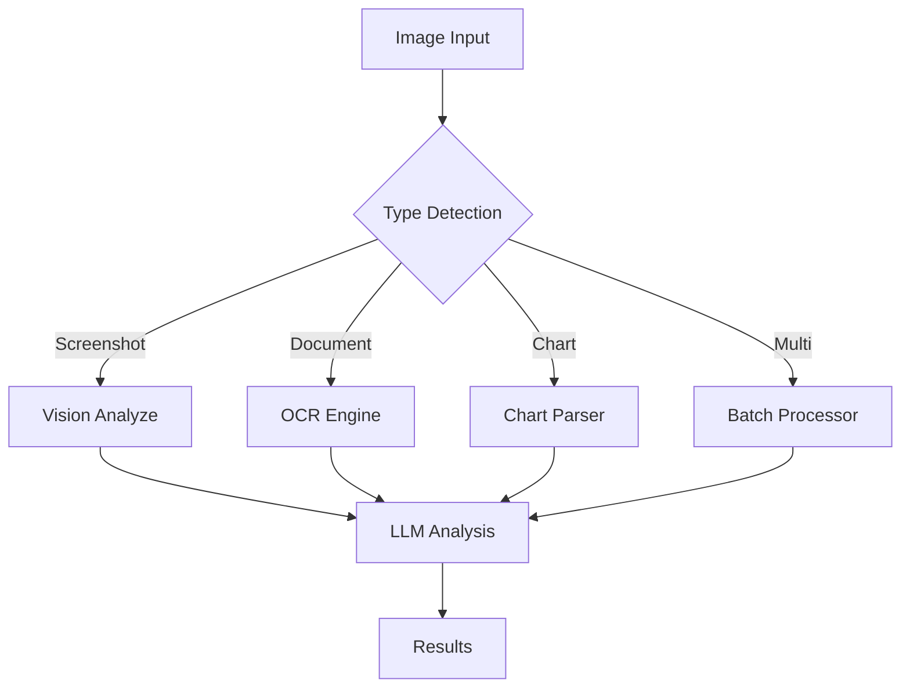

# Plan: Image Processing Tools (图像处理工具)

**模块编号**: MOD-007
**优先级**: High
**状态**: 规划中
**借鉴来源**: 新增功能 + OpenCode Batch Processing

---

## 1. 功能描述

图像处理工具让 Agent 能够理解和处理图像：
- OCR 文本提取 - 从图片中提取文字
- 批量图像分析 - 同时分析多张图片
- 图像对比 - 比较两张图片的差异
- 图表理解 - 解读图表和数据可视化

---

## 2. 现有 Hermes 能力分析

### 已有能力
| 功能 | 文件 | 状态 |
|------|------|------|
| Vision Analyze | `tools/vision_tools.py` | ✅ 已有 |
| Image Generate | `tools/image_generation_tool.py` | ✅ 已有 |

### 差距分析
| 需求 | Hermes 现状 | 需要增强 |
|------|------------|---------|
| OCR 文本提取 | ❌ 依赖 vision | 独立工具 |
| 批量图像分析 | ❌ 不支持 | 新增 |
| 图像对比 | ❌ 不支持 | 新增 |
| 图表解读 | ⚠️ 基础 | 增强 |

---

## 3. 详细设计方案

### 3.1 架构设计



### 3.2 核心组件

```python
# tools/ocr_tool.py (新建)

def check_ocr_requirements() -> bool:
    """检查 OCR 依赖"""
    return importlib.util.find_spec("pytesseract") is not None


def ocr_image_tool(
    image_path: str,
    language: str = "eng",
    preprocess: bool = True,
    task_id: str = None,
) -> str:
    """
    从图像中提取文本 (OCR)
    
    Args:
        image_path: 图像文件路径
        language: OCR 语言 (eng, chi_sim, etc.)
        preprocess: 是否预处理图像
        task_id: 任务 ID
    
    Returns:
        JSON string with extracted text
    """
```

### 3.3 批量处理

```python
# tools/image_batch_analyze.py (新建)

def batch_image_analyze_tool(
    image_paths: List[str],
    user_prompt: str,
    parallel: bool = True,
    task_id: str = None,
) -> str:
    """
    批量分析多张图像
    
    Args:
        image_paths: 图像路径列表
        user_prompt: 分析提示
        parallel: 是否并行处理
        task_id: 任务 ID
    
    Returns:
        JSON string with all results
    """
```

---

## 4. 实施步骤

### Step 1: OCR Tool

**文件**: `tools/ocr_tool.py` (新建)

**依赖**: `pytesseract>=0.3.10`, `Pillow>=10.0.0`

**实现内容**:
- ocr_image_tool() 函数
- 图像预处理
- 多语言支持

**验收标准**:
- [ ] 英文文本正确提取
- [ ] 中文文本正确提取
- [ ] 预处理提升准确率

### Step 2: Batch Analyze

**文件**: `tools/image_batch_analyze.py` (新建)

**依赖**: 复用 vision_tools

**实现内容**:
- batch_image_analyze_tool() 函数
- 并行/串行处理
- 结果汇总

**验收标准**:
- [ ] 多图同时分析
- [ ] 并行处理加速
- [ ] 结果正确汇总

### Step 3: Image Compare

**文件**: `tools/image_compare.py` (新建)

**依赖**: `Pillow>=10.0.0`

**实现内容**:
- image_compare_tool() 函数
- 差异检测算法
- 差异可视化

**验收标准**:
- [ ] 像素级差异检测
- [ ] 差异位置标注
- [ ] 相似度评分

### Step 4: Chart Understanding

**文件**: `tools/chart_understanding.py` (新建)

**实现内容**:
- chart_analyze_tool() 函数
- 图表类型识别
- 数据提取

**验收标准**:
- [ ] 柱状图/折线图识别
- [ ] 数据值提取
- [ ] 图表描述生成

### Step 5: Toolset 更新

**文件**: `toolsets.py`

```python
"image_batch": {
    "description": "Batch image processing and comparison",
    "tools": ["ocr_image", "batch_image_analyze", "image_compare", "chart_analyze"],
}
```

---

## 5. 测试计划

| 测试用例 | 输入 | 期望输出 |
|---------|------|---------|
| test_ocr_english | 英文截图 | 正确文本 |
| test_ocr_chinese | 中文文档 | 正确文本 |
| test_batch_analyze | 3张图片 | 3个结果 |
| test_image_compare | 相似图片 | 差异列表 |

---

## 6. 风险评估

| 风险 | 概率 | 影响 | 缓解措施 |
|------|------|------|---------|
| OCR 准确率低 | 中 | 低 | 预处理 + 多语言 |
| 批量超时 | 中 | 中 | 超时限制 |
| 内存占用 | 中 | 中 | 图片压缩 |

---

## 7. 依赖项

| 依赖 | 来源 | 用途 |
|------|------|------|
| `pytesseract>=0.3.10` | 新增 | OCR 引擎 |
| `Pillow>=10.0.0` | 新增 | 图像处理 |

**系统依赖**: `tesseract-ocr` (需系统安装)

---

## 8. 预估工作量

| 步骤 | 预估时间 | 复杂度 |
|------|---------|--------|
| Step 1: OCR Tool | 2 天 | 中 |
| Step 2: Batch Analyze | 1.5 天 | 中 |
| Step 3: Image Compare | 1.5 天 | 中 |
| Step 4: Chart Understanding | 2 天 | 高 |
| Step 5: Toolset 更新 | 0.5 天 | 低 |
| 测试与修复 | 1.5 天 | 中 |
| **总计** | **9 天** | - |
