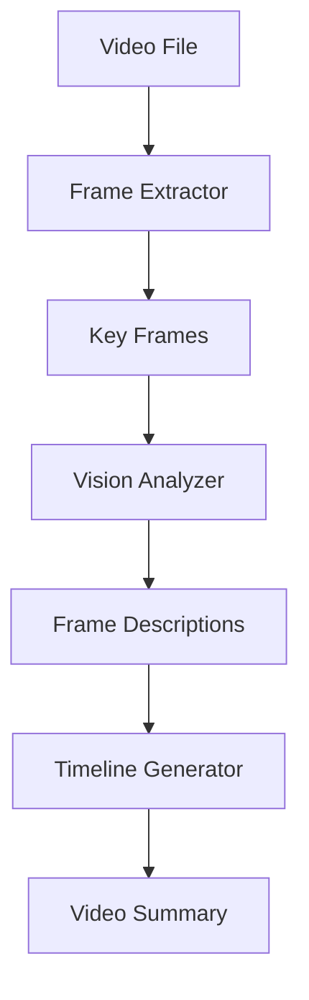

# Plan: Video Processing Tools (视频处理工具)

**模块编号**: MOD-008
**优先级**: Medium
**状态**: 规划中
**借鉴来源**: 新增功能

---

## 1. 功能描述

视频处理工具让 Agent 能够理解和分析视频内容：
- 帧提取 - 从视频提取关键帧
- 视频分析 - 理解视频内容并生成摘要
- 时间线生成 - 标注视频关键事件

---

## 2. 详细设计方案

### 2.1 架构设计



### 2.2 核心组件

```python
# tools/video_frame_extractor.py (新建)

def extract_video_frames_tool(
    video_path: str,
    interval_sec: int = 5,
    max_frames: int = 20,
    timestamp_start: str = None,
    timestamp_end: str = None,
    task_id: str = None,
) -> str:
    """
    从视频提取关键帧
    
    Args:
        video_path: 视频文件路径
        interval_sec: 帧间隔秒数
        max_frames: 最大帧数
        timestamp_start: 开始时间 (HH:MM:SS)
        timestamp_end: 结束时间 (HH:MM:SS)
        task_id: 任务 ID
    
    Returns:
        JSON string with frame paths and timestamps
    """
```

---

## 3. 实施步骤

### Step 1: Frame Extractor

**文件**: `tools/video_frame_extractor.py` (新建)

**依赖**: `opencv-python>=4.9.0`, `ffmpeg-python>=0.2.0`

**实现内容**:
- extract_video_frames_tool() 函数
- 时间范围支持
- 帧采样算法

**验收标准**:
- [ ] 定时帧提取
- [ ] 时间范围正确
- [ ] 帧图片保存

### Step 2: Video Analyzer

**文件**: `tools/video_analyzer.py` (新建)

**实现内容**:
- analyze_video_tool() 函数
- 帧分析整合
- 摘要生成

**验收标准**:
- [ ] 视频内容摘要
- [ ] 关键事件标注
- [ ] 时间线输出

### Step 3: Timeline Generator

**文件**: `tools/video_timeline.py` (新建)

**实现内容**:
- generate_video_timeline_tool() 函数
- 场景检测
- 事件标注

**验收标准**:
- [ ] 时间线正确生成
- [ ] 事件正确标注

---

## 4. 测试计划

| 测试用例 | 输入 | 期望输出 |
|---------|------|---------|
| test_extract_frames | 1分钟视频 | 12帧图片 |
| test_time_range | 指定时间范围 | 范围内帧 |
| test_video_summary | 5分钟视频 | 内容摘要 |

---

## 5. 风险评估

| 风险 | 概率 | 影响 | 缓解措施 |
|------|------|------|---------|
| 视频解码失败 | 中 | 中 | 多种格式支持 |
| 磁盘空间 | 中 | 中 | 自动清理 |
| 处理时间长 | 高 | 低 | 流式处理 |

---

## 6. 依赖项

| 依赖 | 来源 | 用途 |
|------|------|------|
| `opencv-python>=4.9.0` | 新增 | 视频处理 |
| `ffmpeg-python>=0.2.0` | 新增 | 格式转换 |

**系统依赖**: `ffmpeg` (需系统安装)

---

## 7. 预估工作量

| 步骤 | 预估时间 | 复杂度 |
|------|---------|--------|
| Step 1: Frame Extractor | 2 天 | 高 |
| Step 2: Video Analyzer | 1.5 天 | 中 |
| Step 3: Timeline Generator | 1.5 天 | 中 |
| 测试与修复 | 1.5 天 | 中 |
| **总计** | **6.5 天** | - |
