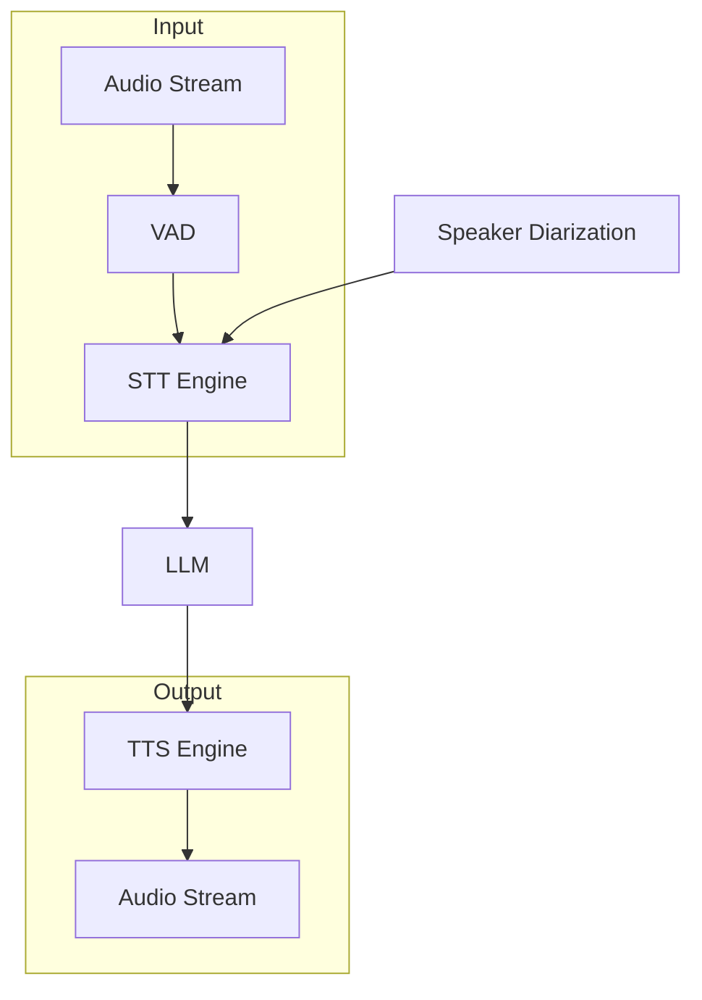

# Plan: Voice Processing Tools (语音处理工具)

**模块编号**: MOD-009
**优先级**: Medium
**状态**: 规划中
**借鉴来源**: 新增功能 + Claude Code Voice

---

## 1. 功能描述

语音处理工具增强 Hermes 的语音交互能力：
- 流式语音处理 - 实时语音对话
- 语音活动检测 - 检测说话者
- 音频格式转换 - 支持多种格式
- 语音指令识别 - 从语音提取意图

---

## 2. 现有 Hermes 能力分析

### 已有能力
| 功能 | 文件 | 状态 |
|------|------|------|
| STT | `tools/transcription_tools.py` | ✅ 已有 |
| TTS | `tools/tts_tool.py` | ✅ 已有 |
| Voice Mode | `tools/voice_mode.py` | ✅ 已有 |

### 差距分析
| 需求 | Hermes 现状 | 需要增强 |
|------|------------|---------|
| 流式语音 | ❌ 不支持 | 新增 |
| 多说话者 | ❌ 不支持 | 新增 |
| 实时 TTS | ❌ 批量 | 增强 |

---

## 3. 详细设计方案

### 3.1 架构设计



### 3.2 核心组件

```python
# tools/audio_streaming.py (新建)

def audio_streaming_tool(
    audio_stream_id: str,
    mode: str = "full_duplex",
    language: str = "auto",
    task_id: str = None,
) -> str:
    """
    流式语音处理
    
    Args:
        audio_stream_id: 音频流 ID
        mode: 模式 (full_duplex/half_duplex)
        language: 语言 (auto/英文/中文)
        task_id: 任务 ID
    
    Returns:
        JSON string with stream status
    """
```

---

## 4. 实施步骤

### Step 1: Audio Streaming

**文件**: `tools/audio_streaming.py` (新建)

**依赖**: `websockets>=12.0`, `asyncio`

**实现内容**:
- audio_streaming_tool() 函数
- WebSocket 流处理
- 实时双向通信

**验收标准**:
- [ ] 流式输入处理
- [ ] 流式输出生成
- [ ] 延迟 < 500ms

### Step 2: Voice Activity Detection

**文件**: `tools/voice_activity_detection.py` (新建)

**依赖**: `webrtc-noise-gain>=2.0`

**实现内容**:
- detect_voice_activity_tool() 函数
- 说话者检测
- 静音检测

**验收标准**:
- [ ] 语音活动检测
- [ ] 说话者数量估计
- [ ] 静音跳过

### Step 3: Audio Processing

**文件**: `tools/audio_processing.py` (新建)

**依赖**: `ffmpeg-python>=0.2.0`

**实现内容**:
- audio_processing_tool() 函数
- 格式转换
- 降噪增强

**验收标准**:
- [ ] 格式转换正确
- [ ] 降噪生效
- [ ] 质量保持

---

## 5. 测试计划

| 测试用例 | 输入 | 期望输出 |
|---------|------|---------|
| test_streaming_input | 实时音频流 | 正确转文本 |
| test_vad | 包含静音的音频 | 检测到语音段 |
| test_format_conversion | mp3 → wav | 正确转换 |

---

## 6. 风险评估

| 风险 | 概率 | 影响 | 缓解措施 |
|------|------|------|---------|
| 延迟过高 | 中 | 中 | 压缩 + 异步 |
| 丢包 | 中 | 低 | 重传机制 |
| 资源占用 | 高 | 中 | 并发限制 |

---

## 7. 依赖项

| 依赖 | 来源 | 用途 |
|------|------|------|
| `websockets>=12.0` | 新增 | WebSocket |
| `webrtc-noise-gain>=2.0` | 新增 | VAD |
| `ffmpeg-python>=0.2.0` | 新增 | 音频处理 |

---

## 8. 预估工作量

| 步骤 | 预估时间 | 复杂度 |
|------|---------|--------|
| Step 1: Audio Streaming | 3 天 | 高 |
| Step 2: VAD | 1.5 天 | 中 |
| Step 3: Audio Processing | 1.5 天 | 中 |
| 测试与修复 | 2 天 | 中 |
| **总计** | **8 天** | - |
